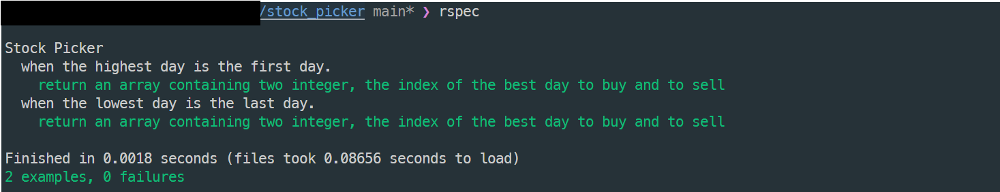

# The Stock Picker algorithm

## About the algorithm

This algorithm is written in Ruby, the goal of this algorithm is to practice some concepts while I was exploring in Ruby.

> [!IMPORTANT]
> I advise people to not use this algorithm in an production application

## Stock Picker

Silly program that takes in an array of stock prices, one for each hypothetical day. It should return a pair of days representing the best day to buy and the best day to sell. 

## Cloning and installation

Clone this repository to your local machine. To do this, click on the green "Code" button at the top right of list of files and copy the link in the prompt. Then, run the following command in your terminal:

    git clone <link>

This will create a folder called 'stock_picker' inside the directory you ran the command in.

CD into that folder:

    cd stock_picker

Now before beginning work on the exercises, you'll want to install a gem called RSpec. RSpec is a popular Ruby testing framework that is used in this repository to provide you with tests that check your solutions.

To install RSpec, run the following command in your terminal:

    gem install rspec

You should see a message that says something along the lines of "6 gems installed" in your terminal. Verify that the installation was successful by simply running the following command:

    rspec

## Usage

There are two ways to try out this algorithm.

### 1 - Directly in interactive ruby console (IRB)

    irb -r ./lib/stock_picker.rb

From there on you can type directly the name of method in the stock_picker file:

    stock_picker

The method is prepared to receive two inputs.

    1 - An array with stock prices

Check out the images below

### 2 - Unit tests execution

Once within the stock_picker cloned directory, you can type directly

    rspec

It runs all unit tests prepared for the stock_picker method.

Check out the image below

## Support

There is no support provide for this algorithm

## Contributing

The repository does not accept contribution due to the fact it was rehearsal

## License

A short and simple permissive license with conditions only requiring preservation of copyright and license notices. Licensed works, modifications, and larger works may be distributed under different terms and without source code. [MIT](LICENSE)
